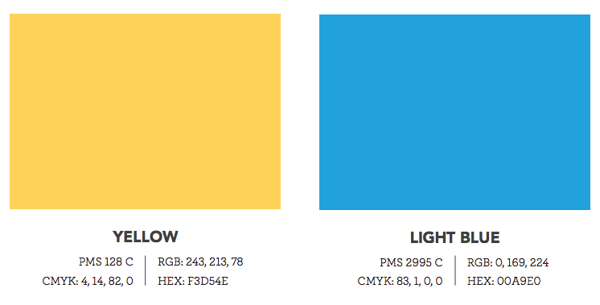
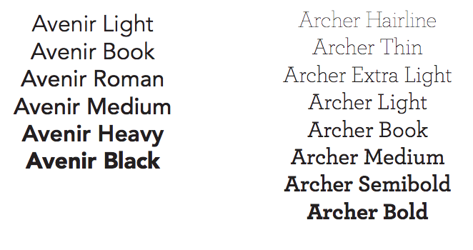
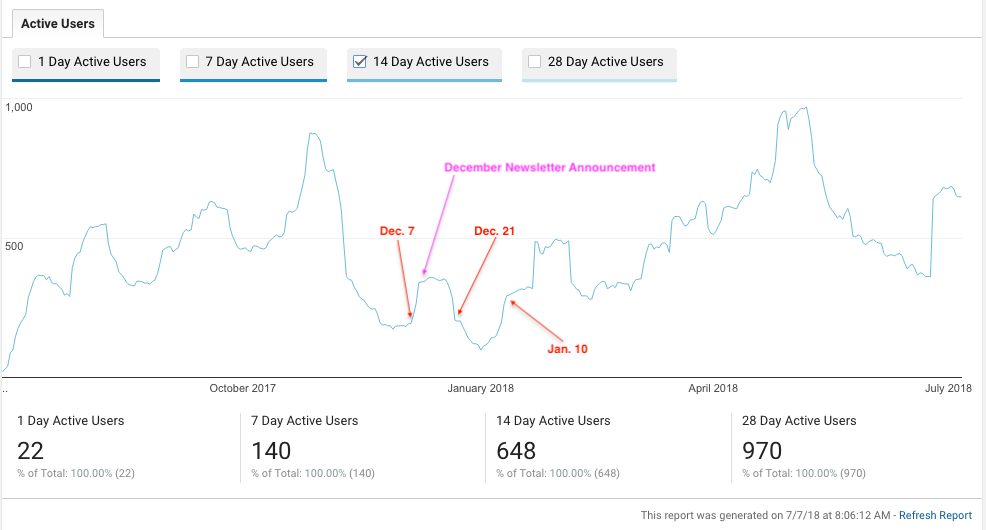
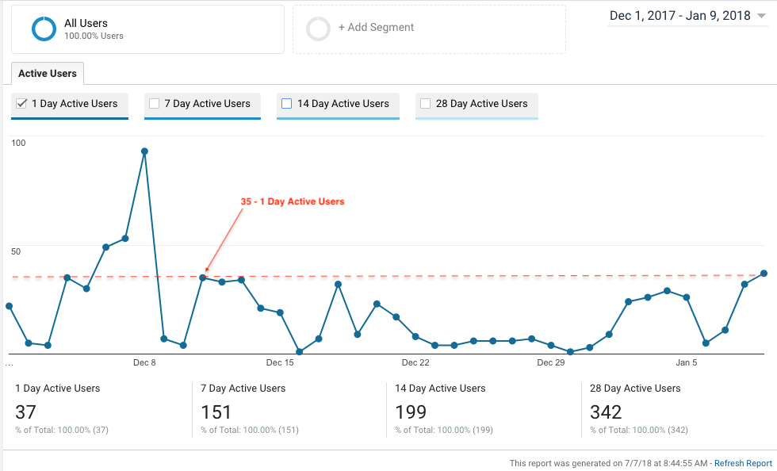

# ALAO Website Refresh

Preliminary schedule and tasks for announcing a redesigned ALAO website at the annual conference and relaunching the site on January 1st, 2019.

## July 2018
> HIGHTLIGHTS
> 
> - Establish clone website for template and theme testing
> - Initial consultant review
> - Establish Task Force
> 
> TASKS
> 
> - Consider strategy, review potential consultant partners
> - Schedule 30 minutes weekly 'check-in' calls with team
> 
> TASK ASSIGNMENTS
> 
> - **Ryan** - 
> - **Tina** -
> - **Melissa** -

Task Force recommended membership:

- Communication Committee Representative:
- IG Representative:
- Web Team Representative: 
- New ALAO Member Representative:
- Continuity Representative:

The role of the Task Force in the redesign should be to bounce ideas off of or for decision-making when equaliy viable alternatives arise. IG Representative should be involved in the design of the universal IG page template.

## August 2018
> HIGHTLIGHTS
> 
> - Finalize timeline. Select consultant.
> - Coordinate with Treasurer for invoicing and payment with 
> - Begin work with consultant
> 
> TASKS
> 
> - Define "Statement of Work" with consultant. Confirm deliverables and timeline targets. Select consultant.
> - Question: who will be the party that enters into the agreement with consultant?
> - Determine who will be the primary point of contact for working with the consultant
> 
> TASK ASSIGNMENTS
> 
> - **Tina**
> - **Ryan**
> - **Ryan**

We'll need to set a clear set of objectives, timelines, and schedule of deliverables.

- Branding Board (Web Design Style Guide) for ALAO to standarized and guide our use of color and font in communications with our membership. These guidelines will be used by the web team during the refresh. Standardized typograhpy and color palettes go a long way.

#### **PRIMARY HEX VALUES AND PRIMARY LOGOS**

These colors would be based off of our primary ALAO logo.

#### **SELECTION OF A PRIMARY FONT STYLE**

Design and instruction on using small set of primary fonts.

There are numerous examples that can be reviewed with a simple Google search. Recommendations would be to include some guideance for (1) Typography, (2) Color, (3) and photography. [Berkeley Guidelines](http://brand.berkeley.edu/visual-design/)

#### Preparation

- Begin to think about the clean-up and consistent application of elements on IG, committee, and other templates sitewide. For instance, heading styles (H2, H3) and lists.
- Begin to plan for replicating the structure of the ACRL archtiecture on the ALAO redeigned site
- Review content with consultant and acquire recommendations: Interest group template needs to list: (1) Current co-chairs, (2) Communications methods, (3) Charge of the group. The previous information will be available in the IG templates. IGs will be able to customize any other sections of their page to include other means of engagement with their membership. Webmasters will not maintain these IG pages. IG Co-chairs will be responsible for adhering to the web design guidelines for any content that is added to their page that is outside of the scope of the template.

#### Information Architecture
- Currently, the ALAO top-level navigation has a "Get Involved" section. For simplicy, the content of this page could be expanded and improved to provide information on the various ways for our membership to interact with ALAO; list volunteer opportunities, projects, and contacts; provide leadership opporunities within, and outside of, ALAO; and highlight other methods of interacting with and between our membership base.
- Seperate the options to "Join" vs. "Review". For an example, [See ACRL Website](http://www.ala.org/acrl/)

## September 2018
> HIGHTLIGHTS
> 
> - Complete set of deliverable from consultant for review
> - **ALAO Board Meeting**: *September XX, 2018* - Board reviews the progress of the web redesign at this meeting.
> 
> TASKS
> 
> - Finalize plans with consultant
> - Confirms plans with ALAO Board
> 
> TASK ASSIGNMENTS
> 
> - **Tina**
> - **Melissa**
> - **Ryan**

## October 2018
> HIGHTLIGHTS
> 
> - Seek board approval for site refresh
> - Changes at this phase could be costly, in terms of financial costs and opportunity costs of the launch
> - Include site refresh screenshots in materials of the conference
> 
> TASKS
> 
> - Prepare "website refresh announcement" for the annual conference
> - Prepare answers for questions like: How will we handle common tasks like membership renewals, if the website needs to be taken offline for a refresh?
> 
> TASKS ASSIGNMENTS
> 
> - **Melissa**
> - **Tina**
> - **Ryan**

## November 2018
> HIGHLIGHTS
> 
> - Preview ALAO site redesign during the annual conference
> 
> TASKS
> 
> - Clean-up code used by 
> - Archive conference website
> - Spin-up a Google Cloud Compute apache server. What information needs to be communicated to ALAO membership during downtime?
> 
> TASK ASSIGNMENTS
> 
> - **Tina**
> - **Ryan**
> - **Melisaa**

## December 2018
> HIGHLIGHTS
>
> - ALAO will need to **refrain** from publishing a December 2018 newsletter
> - Site will be redirected to a temporary server while the theme is swapped and code clean-up is undertaken 
> 
> TASK
> 
> - Modify DNS records for *.alaoweb.org: A records to point to temporary server IP, Remove CNAME
>  
> 
> TASK ASSIGNMENTS
> 
> - **Ryan**
> - **Melissa**
> - **Tina**

Reviewing the Google Analytics data from the previous 365 days, we take a look at the active users report for the year.

Scaling down to the date range of (Decemeber 1st, 2017 - January 10th, 2018), we'll see an anomolous spike in connections to the ALAO website building up to the announcement of the December newsletter. However, the majority of the days are seeing fewer than 35 unique users in a day.

> DEFINITIONS
> 
> The metrics in the report are relative to the last day in the date range you are using for the report. For example:
> 
> - **1-Day Active Users**: The number of unique users who initiated sessions on your site or app on January 28 (the last day of your date range).
> - **X-Day Active Users**: the number of unique users who initiated sessions on your site or app from (the last day of your report and the preceding X days).

## January 2019

> HIGHLIGHTS
> 
> - DNS records for alaoweb.org will be updated
> - Refreshed site will be available on January 1st, 2019
> - Post-launch cleanup can continue as bugs are discovered